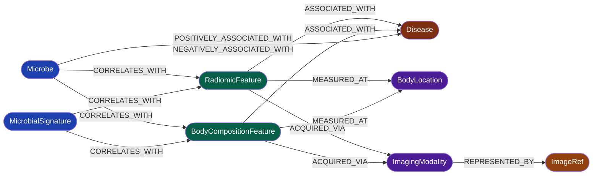

# SanoMap Radiomics Layer

A MINERVA-inspired extension that adds imaging phenotypes to a literature-derived microbiome knowledge graph. Radiomic and body-composition features sit as explicit intermediate nodes between microbes and disease, so microbiome, imaging-phenotype, and disease evidence can be traversed together instead of as a microbe-to-disease view only.

## Knowledge Graph Schema



## Graph Metrics

Counts below are taken from the reconciled, provenance-stamped export bundle
`artifacts/graph_export/` (`manifest.json` is the post-audit source of truth).
"Post-audit" means after the 2026-05-07 vision-edge retraction and the UMLS
entity-gate drop were both composed onto one base.

| Metric | Value |
|---|---|
| Papers in corpus | 1,016 |
| Phenotype mentions extracted | 5,721 |
| Nodes (all types) | 99 |
| Relationship rows (all types) | 189 |
| ASSOCIATED_WITH edges (phenotype → disease) | 74 |
| CORRELATES_WITH edges (microbe → feature, quantitatively verified) | 7 |
| Signed microbe-disease edges (POSITIVELY/NEGATIVELY_CORRELATED_WITH) | 29 |
| MEASURED_AT + ACQUIRED_VIA backbone rows | 78 |
| Disease nodes | 38 |
| Microbe nodes | 23 |
| BodyCompositionFeature nodes | 8 |
| RadiomicFeature nodes | 6 |
| BodyLocation nodes | 18 |
| ImagingModality nodes | 5 |
| ImageRef nodes (Vision Track verified) | 1 |
| End-to-end Microbe → Feature → Disease three-hop paths | 62 |
| Automated test checks passing | 321 |

The 7 CORRELATES_WITH edges are 1 Vision Track (PMC10605408, r=0.95,
Prevotella_nigrescens ↔ GLCM_Correlation, pixel-verified) + 6 Text Track
(Gemini 2.5 Flash-Lite, 7/7 temperature-varied self-consistency). Three of
them close a three-hop path: Ruminococcus → sarcopenia (37 diseases),
Peptostreptococcus stomatis → skeletal_muscle_index (7 diseases), and
Eubacterium → visceral_adipose_tissue (18 diseases).

## Graph Policy

The graph asserts direct evidence only:
- `(Microbe)-[:CORRELATES_WITH]->(RadiomicFeature)`
- `(Microbe)-[:CORRELATES_WITH]->(BodyCompositionFeature)`
- `(MicrobialSignature)-[:CORRELATES_WITH]->(RadiomicFeature)`
- `(MicrobialSignature)-[:CORRELATES_WITH]->(BodyCompositionFeature)`
- `(RadiomicFeature)-[:ASSOCIATED_WITH]->(Disease)`
- `(BodyCompositionFeature)-[:ASSOCIATED_WITH]->(Disease)`
- `(RadiomicFeature)-[:MEASURED_AT]->(BodyLocation)`
- `(BodyCompositionFeature)-[:MEASURED_AT]->(BodyLocation)`
- `(RadiomicFeature)-[:ACQUIRED_VIA]->(ImagingModality)`
- `(BodyCompositionFeature)-[:ACQUIRED_VIA]->(ImagingModality)`
- `(ImagingModality)-[:REPRESENTED_BY]->(ImageRef)`
- `(Microbe)-[:POSITIVELY_ASSOCIATED_WITH / NEGATIVELY_ASSOCIATED_WITH]->(Disease)`

Two audit-only lanes let you inspect the extension without asserting new
graph facts:
- direct text subject-to-phenotype candidates in `phenotype_axis_candidates*.jsonl`
- bridge matches that only share disease context in `bridge_hypotheses*.jsonl`

These audit artifacts are never written as graph edges.

## Repository Map

- Project objective and acceptance criteria:
  [docs/REQUIREMENTS.md](docs/REQUIREMENTS.md)
- Active implementation plan:
  [docs/PLAN.md](docs/PLAN.md)
- Completed work and validation:
  [docs/PROGRESS.md](docs/PROGRESS.md)
- Runtime assumptions and constraints:
  [docs/RUN_CONTEXT.md](docs/RUN_CONTEXT.md)
- Next operational handoff:
  [docs/NEXT_STEPS.md](docs/NEXT_STEPS.md)
- Graph schema (node/edge types):
  [docs/RADIOMICS_LAYER_SPECS.md](docs/RADIOMICS_LAYER_SPECS.md)
- Knowledge map and schema diagram:
  [docs/knowledge_map.md](docs/knowledge_map.md)
- Local artifact explorer:
  [docs/explorer/index.html](docs/explorer/index.html)
- Living manuscript (two-column paper):
  [docs/paper/paper_sanomap_radiomics_layer.tex](docs/paper/paper_sanomap_radiomics_layer.tex)
- Archived proposal report (frozen, pre-reframing):
  [docs/paper/proposal/](docs/paper/proposal/)
- Long-form pipeline tracking:
  [pipeline_tracking.md](pipeline_tracking.md)

## Why This Extension Exists

MINERVA is prior work for large-scale microbe-disease extraction. This repo
is not a reproduction of it. It extends the upstream idea by making imaging
phenotypes explicit nodes and by adding a figure-aware path for quantitative
evidence extraction.

The question it targets: how can microbiome findings be connected to
imaging-derived phenotypes and then to disease in a graph that stays
explainable and reviewable?

## Pipeline Architecture

The pipeline is structured as five independent gates. Each gate is
independently auditable; an edge reaches the graph only after passing every
applicable gate.

| Gate | Purpose | Module | Failure mode |
|---|---|---|---|
| Retrieval (text) | Dense feature-mention retrieval over BioClinical-ModernBERT embeddings; replaces the hand-curated `_FEATURE_VOCAB` substring filter | `src/feature_retrieval.py` | Recall ceiling, threshold τ |
| Entity sanitization | UMLS TUI grounding — a Microbe must ground to T007/T194/T204; gene-function noise is rejected | `src/umls_validator.py` | Coverage gap (novel taxa not in UMLS) |
| Relation acceptance (text) | Gemini 2.5 Flash-Lite, 7-sample temperature-varied self-consistency, full agreement | `scripts/extract_microbe_feature_relations.py` | Self-correlated; does not bound systematic error |
| Verification (vision) | Pixel HSV verifier AND independent VLM verifier with a verifier-only prompt, AND-consensus, fronted by three deterministic pre-verifier gates (caption / colorbar-detect / range-sanity) | `src/verify_vision_dual.py`, `src/vision_gates.py` | Verifier disagreement routes to a human review queue |
| Evaluation | Stratified gold-label benchmark; intra-annotator agreement via 14-day temporal re-labeling | `src/benchmark/sample_gold_set.py` + `evaluate.py` | Single-annotator ceiling; corpus undersizing on rare strata |

### Vision Track scope

Vision-edge verification was audited on 2026-05-07. The dual verifier alone
was found structurally insufficient: both the pixel and the VLM verifier
consume the proposer's bounding box, so a self-consistent fabrication passes
AND-consensus silently. Three deterministic pre-verifier gates in
`src/vision_gates.py` close that gap (caption vocabulary, colorbar
detection, range sanity with VLM colorbar-tick extraction). On a 14-figure
retroactive audit (13 current proposals + 1 historical edge), the post-gate
breakdown was 6 REJECT_GATE / 5 ACCEPT / 3 REVIEW; one historical edge
(PMC6178902, wrong-sign on an LFC-scale figure) was dropped and one
(PMC10605408, a real Spearman heatmap) was retained. The gating chain is the
publishable vision-track contribution; the evidentiary balance is
text-dominant by audited design, not by omission.

## Pipeline At A Glance

1. `src/harvest_pubmed.py`
   harvests literature using split query profiles
2. `src/merge_paper_corpora.py`
   merges the microbiome-side corpora
3. `src/download_pmc_fulltext.py`
   attaches PMC full text when available
4. `src/extract_radiomics_text.py`
   extracts phenotype mentions and feature metadata
5. `src/text_ner_minerva.py`
   extracts disease and microbe-bearing evidence sentences
6. `src/build_relation_input.py`
   joins sentence evidence with phenotype context
7. `src/relation_extract_stage.py`
   predicts and aggregates relation labels
8. `src/index_figures.py`, `src/propose_vision_qwen.py`, `src/verify_heatmap.py`, `src/verify_vision_dual.py`, `src/vision_gates.py`
   support the figure-analysis path
9. `src/assemble_edges.py`
   emits graph-ready phenotype-to-disease edges plus audit-only phenotype-axis artifacts after review
10. `scripts/build_graph_export.py`
    reconciles the divergent artifact vintages into the canonical `artifacts/graph_export/` bundle with a provenance manifest
11. `scripts/neo4j_load.py` + `src/graph_queries.py`
    load the export into a live Neo4j instance and expose read-only, injection-safe canonical traversals

## PubMed Harvest Queries

Query profiles used to build the corpus. Run via
`src/harvest_pubmed.py --query-profile <name>`.

| Profile | Purpose |
|---|---|
| `microbe_radiomics_strict` | Core: radiomic features (GLCM/wavelet/first-order) × microbiome co-mention |
| `microbe_bodycomp` | Body composition (sarcopenia, SMI, VAT) × microbiome |
| `microbe_bodycomp_clinical_recall` | Body composition × microbiome × clinical population |
| `microbe_imaging_adjacent` | Quantitative CT/MRI phenotypes (emphysema, airway, 3D-CT) × microbiome |
| `microbe_imaging_phenotype` | Union of the three microbe-radiomics lanes above |
| `radiomics_disease` | Radiomic features × disease (phenotype-to-disease lane) |
| `bodycomp_disease` | Body composition × disease outcome |
| `bodycomp_disease_association` | Body composition × disease (association + outcome signal) |

Key query blocks (defined in `src/harvest_pubmed.py`):

```
RADIOMICS_FEATURE_BLOCK_STRICT  — GLCM, wavelet, first-order, shape, gldm, LoG,
                                    fractal dimension, quantitative imaging features,
                                    radiogenomics, deep radiomics

BODYCOMP_FEATURE_BLOCK          — sarcopenia, SMI, VAT, SAT, myosteatosis, muscle attenuation,
                                    bone mineral density, hepatic steatosis, PDFF, fat fraction,
                                    intramuscular fat

MICROBIOME_BLOCK                — microbiome, microbiota, gut flora, dysbiosis,
                                    alpha/beta diversity, 16S rRNA, metagenomics,
                                    bacteriome, mycobiome, virome

IMAGING_PHENOTYPE_ADJACENT_BLOCK — quantitative CT, emphysema, airway remodeling,
                                    3D-CT, radiographic phenotype

All primary research only — systematic reviews and meta-analyses are excluded.
```

## Neo4j Graph Queries

After loading the canonical export (`scripts/neo4j_load.py`, fed from
`artifacts/graph_export/`):

```cypher
// Three-hop path: Microbe → Imaging Phenotype → Disease
MATCH (m)-[:CORRELATES_WITH]->(f)-[:ASSOCIATED_WITH]->(d:Disease)
RETURN m.name AS microbe, labels(f)[0] AS feature_type, f.name AS feature, d.name AS disease
ORDER BY m.name, d.name;

// Which imaging features associate with a specific disease?
MATCH (f)-[:ASSOCIATED_WITH]->(d:Disease)
WHERE toLower(d.name) CONTAINS 'colorectal'
RETURN labels(f)[0] AS node_type, f.name AS feature, d.name AS disease;

// Signed microbe-disease associations with weighted evidence
MATCH (m:Microbe)-[r:POSITIVELY_ASSOCIATED_WITH|NEGATIVELY_ASSOCIATED_WITH]->(d:Disease)
RETURN m.name AS microbe, type(r) AS direction, d.name AS disease,
       r.net_confidence, r.positive_support, r.negative_support
ORDER BY r.net_confidence DESC;

// CT radiomic features measured at a specific body location
MATCH (f:RadiomicFeature)-[:MEASURED_AT]->(bl:BodyLocation)
WHERE bl.name = 'liver'
RETURN f.name AS feature, bl.name AS location;

// Full four-part chain with modality backbone
MATCH (m:Microbe)-[:CORRELATES_WITH]->(f)-[:ACQUIRED_VIA]->(mod:ImagingModality)
MATCH (f)-[:ASSOCIATED_WITH]->(d:Disease)
RETURN m.name, f.name, mod.name, d.name;

// Vision Track verified correlation edge
MATCH (m:Microbe)-[r:CORRELATES_WITH]->(f)
WHERE r.evidence_type = 'vision_verified'
RETURN m.name, f.name, r.r_value, r.confidence, r.pmid;
```

## Prior Work And Boundary

- Prior work: MINERVA is the methodological inspiration for large-scale
  microbiome relationship mining.
- This project: a radiomics-first imaging-phenotype extension built on that
  direction, not a claim of exact upstream reproduction.
- Model policy: substitute models are used where upstream-associated
  checkpoints are not available in this workspace.
- Checkpoint access: if upstream-mediated access later becomes available,
  the repo should document the model ids and rerun steps while keeping
  restricted weights out of Git history.

## BNER Provenance Note

The MINERVA paper states that microbial NER used `BNER2.0` and reused the
original authors' public GitHub splits.

Current verification status:
- strongest public candidate lineage: `https://github.com/lixusheng1/bacterial_NER`
- the checked-in `test_set.iob` in that repo matches MINERVA's reported
  `2,043` bacterial test entities
- exact release parity is unconfirmed because the checked-in public corpus
  totals do not match MINERVA's full reported `BNER2.0` totals

This repo treats `lixusheng1/bacterial_NER` as the strongest public
candidate source for MINERVA-style microbial NER training data, not as the
confirmed upstream release.

## Status

- The full 1,016-paper corpus has been run through the extraction pipeline
  (640 initial papers + 376 net-new from four added query lanes).
- Disease-string quality: sentence-fragment noise is removed at two layers
  (`_detect_disease()` stopword expansion + assembly-side prefix/substring
  patterns). The graph carries 38 Disease nodes after filtering.
- The imaging backbone (BodyLocation + ImagingModality) is implemented with
  expanded vocabulary coverage; the ImageRef node type completes the
  Disease ← Feature → BodyLocation / ImagingModality → ImageRef chain.
- The Vision Track is end-to-end with all four figure types
  (heatmap, forest plot, scatter plot, dot plot) and the post-2026-05-07
  pre-verifier gate chain.
- A single regenerable graph artifact exists: `scripts/build_graph_export.py`
  emits `artifacts/graph_export/` (189 rows / 99 nodes) with a provenance
  `manifest.json` (source vintages, git SHA, drop records). A live Neo4j path
  (`scripts/neo4j_load.py`, `src/graph_queries.py`, `docker-compose.neo4j.yml`,
  `docs/NEO4J_RUNBOOK.md`) is in place; live import is operator-run.
- The local pytest suite is green at `321 passed / 0 failed`.

## Open Items

- The static explorer (`docs/explorer/index.html`) currently reads a frozen
  2026-04-05 JSONL snapshot, not the canonical export. Rewiring it onto
  `artifacts/graph_export/` (or live Neo4j via `src/graph_queries.py`) is the
  remaining application work.
- The manuscript's measured P/R/F1 + Cohen's κ are gated on the gold-set
  Pass-2 re-labeling, which cannot start before the 14-day temporal window
  closes (earliest 2026-05-21).
- Whether broad disease targets such as `inflammation` should remain
  graph-eligible is an open review question; only reviewed outputs are
  promoted to edge assembly.
