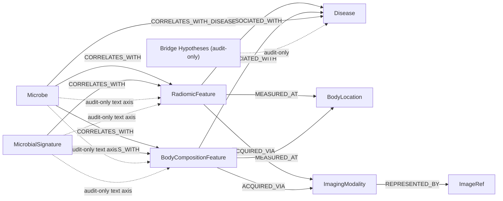

# Knowledge Map

This repository builds the microbiome + imaging phenotype portion of the SanoMap knowledge graph. All extracted artifacts remain organized around the same direct-evidence policy that MINERVA uses: only verified figure edges are promoted to `CORRELATES_WITH`, only text-derived phenotype-to-disease edges are admitted as `ASSOCIATED_WITH`, and direct text subject-to-phenotype candidates or shared-disease bridge matches stay in audit-only lanes.

The following Mermaid diagram makes the current schema explicit:

Each edge is grounded in a particular pipeline stage:

- `Microbe`/`MicrobialSignature` candidates come from the MINERVA-aligned NER + cleanup pipeline.
- `RadiomicFeature` and `BodyCompositionFeature` nodes originate in the radiomics text extractor plus vision verification stages.
- `Disease` mentions are filtered through the shared span cleanup helper before entering the relation extractor.
- `BodyLocation` nodes (liver, lung, colon, abdomen, etc.) are extracted from text mentions that carry a `body_location` field. They link to phenotype features via `MEASURED_AT`.
- `ImagingModality` nodes (CT, MRI, PET, DXA, etc.) are extracted from text mentions that carry a `modality` field, with DICOM codes where applicable. They link to phenotype features via `ACQUIRED_VIA` and to representative figures via `REPRESENTED_BY`.
- `ImageRef` nodes are first-class graph nodes produced from verified Vision Track figures. Each node stores the PMCID, figure ID, panel ID, topology (heatmap/forest_plot), and image path. They complete the professor's four-part chain: `Disease ← Feature → BodyLocation / ImagingModality → ImageRef`.
- `CORRELATES_WITH_DISEASE` edges are direct signed microbe-disease edges derived from MINERVA-aligned relation extraction with self-consistency, separate from the phenotype axis.
- `PhenotypeAxisCandidate` rows capture direct text subject-to-phenotype evidence candidates and remain explicitly marked `not_for_graph_ingestion`.
- `BridgeHypothesis` rows are retained in audit artifacts but explicitly marked as `not_for_graph_ingestion` so they never become asserted edges.
